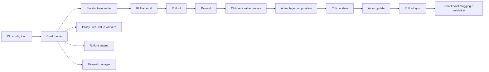

# Nanoverl Architecture

`nanoverl` now has a complete local `Phase 1` path, the intended `Phase 2` usability layer, and multiple `Phase 3` backend expansions: the debug scaffold remains intact, the single-process Hugging Face PPO path stays the readable baseline, a first single-node FSDP training path runs through the same trainer loop, and a thin synchronous `vllm` rollout backend now plugs into that loop without widening the trainer abstraction.

## Implemented Foundations

- `nanoverl.core.RLBatch`
  - Small batch transport with `repeat`, `union`, `chunk`, `concat`, `reorder`, and `pad_to_divisor`.
- `nanoverl.config.TrainerConfig`
  - Single typed config tree for data, algorithm, actor, critic, reference, rollout, reward, trainer, and ray.
- `nanoverl.trainer.RLTrainer`
  - Driver-owned synchronous loop in the intended PPO ordering.
- `nanoverl.reward.RewardManager`
  - Python reward-function interface with terminal-token reward expansion.
- `nanoverl.rollout.DebugRolloutEngine`
  - Deterministic rollout backend for smoke tests and algorithm debugging.
- `nanoverl.rollout.HFRolloutEngine`
  - Local decoder-only rollout using `transformers.generate()` with the same trainer contract as the debug backend.
- `nanoverl.rollout.VLLMRolloutEngine`
  - Local decoder-only rollout using `vllm.LLM.generate()` and `LLM.update_weights()` while preserving the same batch contract as the debug and HF rollout engines.
- `nanoverl.workers.Debug*Worker`
  - Explicit policy, reference, and value worker boundaries.
- `nanoverl.workers.HF*Worker`
  - Local policy, reference, and value workers backed by `torch` and `transformers`.
- `nanoverl.backends.train.FSDP*Worker`
  - First single-node multi-GPU training backend using torch FSDP while preserving the same worker interfaces and trainer loop.
- `nanoverl.checkpoint.CheckpointManager`
  - Local save/resume of trainer and worker state.

## Current Contracts

- Both rollout backends now populate the same RL fields:
- All rollout backends now populate the same RL fields:
  - `prompts`
  - `responses`
  - `input_ids`
  - `attention_mask`
  - `response_mask`
  - `rollout_log_probs`
  - `response_text`
- The trainer still owns the PPO ordering:
  - rollout
  - reward
  - old/ref/value passes
  - advantage computation
  - critic update
  - actor update
  - rollout weight sync
  - validation and checkpointing

## Phase 2 Progress

- `trainer.balance_batch` is now active and applies one explicit driver-side batch balancing step after rollout.
- GRPO is now a first-class actor-only path on the same trainer skeleton instead of an algorithm helper that happened to exist.
- Reward plugins now support either a scalar score or a mapping with `score` plus extra fields.
- Training and validation can now write lightweight JSON previews of rollout rows, so failed runs can be inspected without adding many more metrics.
- Validation keeps the metric surface small and only summarizes clear reward extras:
  - `val/reward_mean`
  - `val/<data_source>/reward_mean`
  - `val/extra/<name>_mean` for numeric reward extras
- Training metrics also stay intentionally small:
  - response clip ratio
  - non-aborted response length mean
  - value explained variance when the critic is active

## Why This Direction Still Matches `verl`

- The important `verl` RL semantics are preserved:
  - rollout before reward and policy/value evaluation
  - explicit old policy / reference / value ownership
  - advantage computation on the driver
  - critic update before actor update
  - rollout weight refresh after actor update
  - validation through the same rollout-plus-reward path
- The current gap versus a fuller `verl`-style core is now mostly about research usability and backend breadth, not about missing PPO loop semantics.

## Intentional Gaps

- The local HF backend is intentionally single-process and decoder-only first.
- The current `vllm` rollout path is intentionally synchronous and local:
  - no async server mode
  - no Ray rollout workers
  - no multi-turn/tool rollout
  - tensor-parallel rollout is still limited to `1` in this thin design
- Ray integration is still intentionally thin.
- SGLang, LoRA, reward-model serving, and multi-turn/tool rollout are still deferred.

## Phase 3 Progress

The current repo now has the first serious Phase 3 backend slice:

- grouped rollout balancing is active
- GRPO is explicit and actor-only
- reward extras flow through validation and debug artifacts
- lightweight experiment previews exist without overwhelming metric noise
- `nanoverl.cli.train_rl` is now the canonical training launcher for debug, HF-local, and FSDP presets
- the first FSDP path uses rank-aware dataloading, rank-0 logging/checkpointing, and shared validation summaries
- the first `vllm` rollout path keeps validation, checkpoint/resume, and rollout-policy sync on the same trainer path as HF rollout

The next serious step should stay within `Phase 3`, but move from the first thin `vllm` rollout slice to either broader rollout backend coverage or memory-efficiency features that matter for real experiments.
