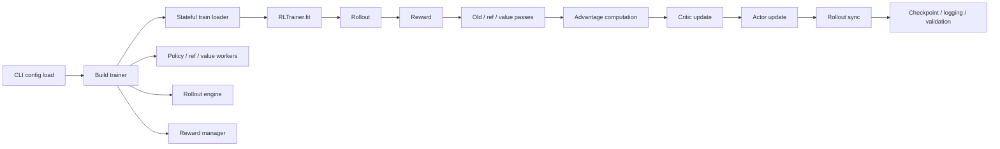

# Nanoverl Architecture

`nanoverl` now has a first runnable RL scaffold with one clear control path:

## Implemented Foundations

- `nanoverl.core.RLBatch`
  - Small batch transport with `repeat`, `union`, `chunk`, `concat`, `reorder`, and `pad_to_divisor`.
- `nanoverl.config.TrainerConfig`
  - Single typed config tree for data, algorithm, actor, critic, reference, rollout, reward, trainer, and ray.
- `nanoverl.trainer.RLTrainer`
  - Driver-owned synchronous loop in the intended PPO ordering.
- `nanoverl.reward.RewardManager`
  - Python reward-function interface with terminal-token reward expansion.
- `nanoverl.rollout.DebugRolloutEngine`
  - Deterministic rollout backend for smoke tests and algorithm debugging.
- `nanoverl.workers.Debug*Worker`
  - Explicit policy, reference, and value worker boundaries.
- `nanoverl.checkpoint.CheckpointManager`
  - Local save/resume of trainer and worker state.

## Intentional Gaps

- FSDP is scaffolded as an explicit backend entry point, but real torch-backed model integration is still pending.
- Ray integration is intentionally thin for now because this environment does not have Ray installed.
- The built-in dataset loader is JSON/JSONL-first so the scaffold stays runnable without extra dependencies.

## Recommended Next Extension

Wire the FSDP backend to a real model engine first, then swap the debug rollout for a wrapped inference backend while keeping the trainer loop unchanged.
