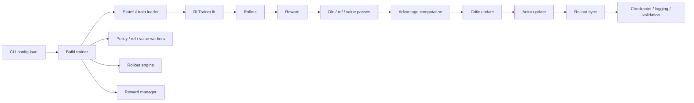

# Nanoverl Architecture

`nanoverl` is now in late `Phase 1`: the debug scaffold remains intact, and the first local Hugging Face PPO path has been wired into the same trainer loop.

## Implemented Foundations

- `nanoverl.core.RLBatch`
  - Small batch transport with `repeat`, `union`, `chunk`, `concat`, `reorder`, and `pad_to_divisor`.
- `nanoverl.config.TrainerConfig`
  - Single typed config tree for data, algorithm, actor, critic, reference, rollout, reward, trainer, and ray.
- `nanoverl.trainer.RLTrainer`
  - Driver-owned synchronous loop in the intended PPO ordering.
- `nanoverl.reward.RewardManager`
  - Python reward-function interface with terminal-token reward expansion.
- `nanoverl.rollout.DebugRolloutEngine`
  - Deterministic rollout backend for smoke tests and algorithm debugging.
- `nanoverl.rollout.HFRolloutEngine`
  - Local decoder-only rollout using `transformers.generate()` with the same trainer contract as the debug backend.
- `nanoverl.workers.Debug*Worker`
  - Explicit policy, reference, and value worker boundaries.
- `nanoverl.workers.HF*Worker`
  - Local policy, reference, and value workers backed by `torch` and `transformers`.
- `nanoverl.checkpoint.CheckpointManager`
  - Local save/resume of trainer and worker state.

## Current Contracts

- Both rollout backends now populate the same RL fields:
  - `prompts`
  - `responses`
  - `input_ids`
  - `attention_mask`
  - `response_mask`
  - `rollout_log_probs`
  - `response_text`
- The trainer still owns the PPO ordering:
  - rollout
  - reward
  - old/ref/value passes
  - advantage computation
  - critic update
  - actor update
  - rollout weight sync
  - validation and checkpointing

## Intentional Gaps

- The local HF backend is intentionally single-process and decoder-only first.
- FSDP is still scaffolded as an explicit backend entry point, but not yet implemented.
- Ray integration is still intentionally thin.
- vLLM, SGLang, LoRA, reward-model serving, and multi-turn/tool rollout are still deferred.

## Recommended Next Extension

Use the new local HF path to harden Phase 1 semantics first:

- add stronger HF checkpoint and rollout-sync regression tests once dependencies are available in the workspace
- improve config validation around HF batch sizing and tokenizer/model compatibility
- then decide whether the next serious backend step is `FSDP` training or a thin reusable inference adapter such as `vLLM`
